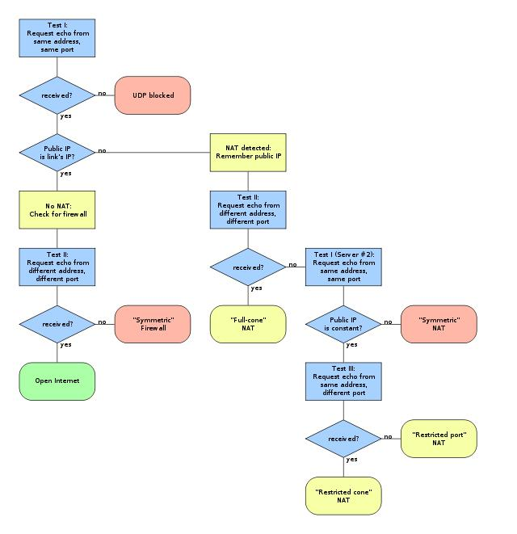

# 端口映射
基于端口映射实现内网穿透等功能

[udp打洞/p2p穿透/种子 详解](https://www.cnblogs.com/LittleHann/p/5556185.html)

## frp
[frp](https://github.com/fatedier/frp/blob/master/README.md)

frp 是一个专注于内网穿透的高性能的反向代理应用, 可以将内网服务以安全,便捷的方式通过具有公网 IP 节点的中转暴露到公网.

frp 支持 内网穿透模式 和 p2p 模式
- 内网穿透用于登录等小流量高网速操作, p2p 用于传输大文件

### 使用
frps 公网IP所在机器, frpc 是局域网机器所在机器.

流程
1. 在公网机器启动 frps 服务.
2. 在局域网机器启动 frpc 服务, 然后 frpc 会自动与 frps 建立连接并保证连接有效(有自动重连).
3. user 可以通过访问 frps 直接访问 frpc 服务所在的机器.

frp 可以通过编写脚本实现由 systemd 管理. 脚本编写方式参考
1. [systemd](/soft/systemd.md#systemd脚本)
2. [frpc.service](./service/frpc.service)
3. [frps.service](./service/frps.service)

配置示例如下

```INI
# frpc
[common]
server_addr = xxx
server_port = 6000

[ssh_pc]
type = tcp
local_ip = 127.0.0.1
local_port = 22
remote_port = xxx

# smb 客户端配置
[p2p_smb_visitor]
type = xtcp
role = xxx
server_name = p2p_smb
# 只有 sk 一致的用户才能访问到此服务
sk = xxxxx
bind_addr = 127.0.0.1
bind_port = 445

# smb 服务端配置, 提供数据的一方
[p2p_ssh]
type = xtcp
sk = xxxxx
local_ip = 127.0.0.1
local_port = 445
```

```INI
# frps
[common]
bind_port = 6000
# p2p 需要开通 udp 端口
bind_udp_port = 7000
```

## 引用
### UDP打洞、P2P组网方式研究
> 地址: https://www.cnblogs.com/LittleHann/p/5556185.html

1. NAT概念
2. P2P概念
3. UDP打洞
4. P2P DEMO
5. ZeroNet P2P

----
NAT概念

在STUN协议中，根据内部终端的地址(LocalIP:LocalPort)到NAT出口的公网地址(PublicIP:PublicPort)的影射方式，把NAT分为四种类型(rfc3489: http://www.ietf.org/rfc/rfc3489.txt)
1. Full Cone: 这种NAT内部的机器A连接过外网机器C后，NAT会打开一个端口，然后外网的任何发到这个打开的端口的UDP数据报都可以到达A。不管是不是C发过来的(NAT源端口映射)
2. Restricted Cone: 这种NAT内部的机器A连接过外网的机器C后，NAT打开一个端口，然后C可以用任何端口和A通信，其他的外网机器不行(目的IP映射)
3. Port Restricted Cone: 这种NAT内部的机器A连接过外网的机器C后，NAT打开一个端口，然后C可以用原来的端口和A通信，其他的外网机器不行(NAT目的端口映射)
4. Symmetic: 对于这种NAT.连接不同的外部目标。原来NAT打开的端口会变化，而Cone NAT不会，虽然可以用端口猜测，但是成功的概率很小

或者分为2类
1. 基本的NAT: 一个私有网络(域)中的节点中只有很少的节点需要与外网连接。那么这个子网中其实只有少数的节点需要全球唯一的IP地址，其他的节点的IP地址应该是可以重用的。因此，基本的NAT实现的功能很简单，在子网内使用一个保留的IP子网段，这些IP对外是不可见的。子网内只有少数一些IP地址可以对应到真正全球唯一的IP地址。如果这些节点需要访问外部网络，那么基本NAT就负责将这个节点的子网内IP转化为一个全球唯一的IP然后发送出去(基本的NAT会改变IP包中的原IP地址，但是不会改变IP包中的端口)
2. NAPT(Network Address/Port Translator): NAPT不但会改变经过这个NAT设备的IP数据报的IP地址，还会改变IP数据报的TCP/UDP端口
  - 如果Client A想向Client B发送信息，那么Client A发送命令给Server S，请求Server S命令Client B向Client A方向打洞
  - 如果Client B想向Client A发送信息，那么Client B发送命令给Server S，请求Server S命令Client A向Client B方向打洞

总体来说，P2P(NAT环境下)的通信都是被动反向的，即谁想向谁发送数据，需要通知对方向自己"打洞"

---
P2P概念

P2P是peer-to-peer的缩写，peer在英语里有"(地位、能力等)同等者"、"同事"和"伙伴"等意义。这样一来，P2P也就可以理解为"伙伴对伙伴"的意思，或称为对等联网，简单的说，P2P直接将人们联系起来，让人们通过互联网直接交互。P2P使得网络上的沟通变得容易、更直接共享和交互，真正地消除中间商。P2P就是人可以直接连接到其他用户的计算机、交换文件，而不是像过去那样连接到服务器去浏览与下载。P2P另一个重要特点是改变互联网现在的以大网站为中心的状态、重返“非中心化”，并把权力交还给用户

事实上，网络上现有的许多服务可以归入P2P的行列。即时讯息系统譬如ICQ、AOL Instant Messenger、Yahoo Pager、微软的MSN Messenger以及国内的OICQ是最流行的P2P应用

普通的直连式P2P实现


STUN方式的P2P实现

STUN是RFC3489规定的一种NAT穿透方式，STUN的探测过程需要有一个公网IP的STUN server，在NAT后面的UAC必须和此server配合，互相之间发送若干个UDP数据包。UDP包中包含有UAC需要了解的信息，比如NAT外网IP，PORT等等。UAC通过是否得到这个UDP包和包中的数据判断自己的NAT类型，假设如下场景
1. UAC(B): UAC的IP为IPB
2. NAT(A): NAT的IP为IPA
3. SERVER(C): SERVER的IP为IPC1 、IPC2
  - 服务器C有两个IP

NAT的探测过程


---
P2P文件传输协议之BitTorrent协议

Bittorrent与其他传统P2P软件如Gnutella,Fasttrack不同,Bittorrent只是一个纯粹的文件下载协议,并提供搜索功能,所以往往资源的获取要跟其他一些应用结合起来,比如说发布Bittorrent种子信息的网站

*Bittorrent工作原理*

Bittorrent的工作原理其实很简单,他就是将一份数据分隔成256K大小的数据分组,并在Bittorrent 网络中一群用户相互协作完成这些数据的分发,用户参与数据分发的信息已文件的形式存储,一般可以通过web网站获取这些信息但是实际数据传输依靠的不是Http协议,而是由专门的P2P协议来完成,这些对于用户都是透明的

普通的HTTP/FTP下载使用TCP/IP协议,BitTorrent协议是架构于TCP/IP协议之上的一个P2P文件传输协议,处于TCP/IP结构的应用层｡ BitTorrent协议本身也包含了很多具体的内容协议和扩展协议,并在不断扩充中

根据BitTorrent协议,文件发布者会根据要发布的文件生成提供一个.torrent文件,即种子文件,也简称为“种子"｡ .torrent文件本质上是文本文件,包含Tracker信息和文件信息两部分

1. Tracker信息主要是BT下载中需要用到的Tracker服务器(中间人服务器)的地址，以及针对Tracker服务器的设置
2. 文件信息是根据对目标文件的计算生成的计算结果根据BitTorrent协议内的B编码规则进行编码，它的主要原理是需要把提供下载的文件虚拟分成大小相等的块，块大小必须为2k的整数次方(由于是虚拟分块,硬盘上并不产生各个块文件)，并把每个块的索引信息和Hash验证码写入.torrent文件中
3. 所以,.torrent文件就是被下载文件的"索引"

*种子文件结构*
一个种子文件，通常是以.torrent后缀结尾。BitTorrent协议规定，torrent文件本身，内容必须是utf8编码格式，并且其中的字段结构采用bencoding编码格式

Torrent种子文件由两部分组成：announce(tracker url)和文件信息，该种子文件的一部分如下，根据bencoding编码格式，把这段字符解码还原后

````
announce:http://www.chinahdtv.org/announce.php?passkey=6e7a1c7ca4164d87e9b0e00ec63aa749
created by:uTorrent/2040
creation date:1369699038
encoding:UTF-8
info:
{files:[
{length:158784,path:[Iron.Man.3.2013.HDSCR.ULTRA.EDiTiON.720p.x264.chn.srt]}, {length:107117,path:[Iron.Man.3.2013.HDSCR.ULTRA.EDiTiON.720p.x264.chn1.srt]}, {length:93644,path:[Iron.Man.3.2013.HDSCR.ULTRA.EDiTiON.720p.x264.chn2.srt]},
{length:4272200020,path:[Iron.Man.3.2013.HDSCR.ULTRA.EDiTiON.720p.x264.mkv]}],
name:钢铁侠3.Iron.Man.3.2013.HDSCR.ULTRA.EDiTiON.720p.x264,
piece length:4194304,
pieces:P1,P2,P3...P1019
private:1
source:[hd.gg] CNHD ChinaHDTV
}

// 解释
1. tracker地址，这里就是announce后面的url
2. 种子创建软件及其版本号，这里是uTorrent软件创建的，版本号为2040
3. 创建日期，这里是1369699038，这个数字显示的是从UTC 1970-1-1 00:00:00到到现在所经历的秒数
4. 编码格式，这里是UTF-8(codepage=936)
5. info区，这里指定的是该种子有几个文件，文件有多长，目录结构，以及目录和文件的名字
6. Name字段，指定顶层目录名字
7. 每个段的大小，Bittorrent协议是把一个文件分成很多个小段，然后分段下载的，这个地方就是指定每个段的大小，单位是字节，这里每个段的大小大约为4MB(4194304)
8. 段哈希值，就是整个种子中，每个段的SHA1哈希值拼在一起，每个段的哈希长度是固定的，20个字符，所以pieces后面跟的那个数字20380其实是段数量*20，如果你用20380除以20，就会发现这个种子段数量为1019，乘上前面的段大小，这个种子大概有4GB大小，也就是说你把这个种子下载完后，占硬盘4GB空间
9. private值，这个属性主要显示这个种子是私有的，还是公有的。一般那些各大PT站就是私有的。私有的种子会禁掉DHT(distributed hash table)，因为如果你的client开这个功能，那就会跳过tracker来和其他peer进行数据交换，在很多PT内站(CHDbits,CMCT,CNHD)把这种行为称为作弊，会直接ban掉你在PT站上的帐号
10. 源，显示该种子的来源，这里是CNHD
````
*BitTorrent通信流程与网络包结构*

http://www.cnblogs.com/LittleHann/p/3837839.html

*BitTorrent下载*

下载者要下载文件内容,需要先得到相应的.torrent文件,然后使用BT客户端软件进行下载(读取.torrent文件中的索引)
1. 下载时,BT客户端首先解析.torrent文件得到Tracker地址,然后连接Tracker服务器
2. Tracker服务器回应下载者的请求,提供下载者其他下载者(包括发布者)的IP(相当于打洞过程)
3. 下载者再连接其他下载者
4. 根据.torrent文件,两者分别对方告知自己已经有的块,然后交换对方没有的数据
5. 此时不需要其他服务器参与,分散了单个线路上的数据流量,因此减轻了服务器负担(打洞完成后，不再需要中间人服务器的参与，通信双方直接进行点对点通信)
6. 下载者每得到一个块,需要算出下载块的Hash验证码与.torrent文件中的对比,如果一样则说明块正确,不一样则需要重新下载这个块，这种规定是为了解决下载内容准确性的问题

一般的HTTP/FTP下载,发布文件仅在某个或某几个服务器,下载的人太多,服务器的带宽很易不胜负荷,变得很慢，而BitTorrent协议下载的特点是,下载的人越多,提供的带宽也越多,种子也会越来越多,下载速度就越快

相关: 
http://www.2cto.com/net/200506/5494.html
http://www.cppblog.com/peakflys/archive/2013/01/25/197562.html
http://blog.chinaunix.net/uid-11572501-id-2868679.html
https://github.com/Martiusweb/p2p
http://network.51cto.com/art/201006/207932.htm
http://blog.csdn.net/wengpingbo/article/details/9174363
https://github.com/axeliux/P2P


---
UDP打洞

流程
1. 首先，Client A登录服务器，NAT A为这次的Session分配了一个端口60000，那么Server S收到的Client A的地址是202.187.45.3:60000，这就是Client A的外网地址了
2. 同样，Client B登录Server S，NAT B给此次Session分配的端口是40000，那么Server S收到的B的地址是187.34.1.56:40000
3. 此时，Client A与Client B都可以与Server S通信了。如果Client A此时想直接发送信息给Client B，那么他可以从Server S那儿获得B的公网地址187.34.1.56:40000，但是Client A不能直接向这个地址发送信息，因为如果这样发送信息，NAT B会将这个信息丢弃(因为这样的信息是不请自来的，为了安全，大多数NAT都会执行丢弃动作)。现在我们需要的是在NAT B上打一个方向为202.187.45.3(即Client A的外网地址)的洞，那么Client A发送到187.34.1.56:40000的信息,Client B就能收到了。这个打洞命令由谁Server S来发出(Server S只是作为一个中转代理)
4. 总结一下这个过程：如果Client A想向Client B发送信息，那么Client A发送命令给Server S，请求Server S命令Client B向Client A方向打洞。然后Client A就可以通过Client B的外网地址与Client B通信了

需要注意
1. 在NAT模式下，内网的IP是不能被外网直接正向访问到的，只能又内网IP向外网IP主动发起连接，一旦连接成功建立起来，后续的交互通信是完全正常的
2. 而P2P要面对的问题就是两个IP都在NAT内网中，谁也无法率先发起连接(NAT会拒绝"不请自来"的外网连接)，所以需要事先在"中间人(Server S)"上进行登记，登记的内容为对应的NAT公网IP:PORT
3. 如果某个NAT内网IP需要向另一个NAT内网IP进行通信，需要"通知"中间人Server S，由它转发来告知目标NAT IP主动向自己主动发起连接，这谓之"打洞"，"打洞"完成后，当前NAT就记录了当前NAT IP和目标NAT外网IP的的会话记录了，而此时对于对方的NAT来说，同样也记录一个会话，解决了"鸡生蛋，蛋生鸡"的问题后，此后，两个NAT内网IP就可以互相开始正常通信了

---
后续稍后再改
