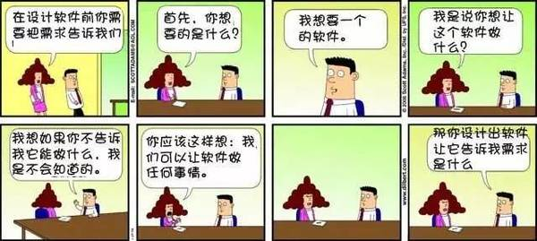

## 程序员才是天生段子手

> 杀一个程序员不需要用枪，
> 改三次需求就可以了！

> 当别人写的bug，让自己发现的时候：  
> 我操这个大撒比写出这么个烂代码  
> 幸亏有哥这样神一样的存在才发现  
> 哥真是救世主  
> 没有哥这个公司分分钟要倒闭。  

> 柳依依说：其实我爸是个程序员  
> 大姐叫玲玲  
> 姐叫玲依  
> 姐叫依玲  
> 妹妹叫忆初  

> 诸葛亮是一个优秀的程序猿，每一个锦囊都是应对不同的case而编写的!  
> 是优秀的程序猿也敌不过更优秀的bug！  
> 出祈山，七进中原，鞠躬尽瘁，死而后已的诸葛亮只因为有一个错误的case-马谡，整个结构就被break了！

> 两个程序员，一个技术精湛，思维严谨，认真负责，Bug 极少，至今单身；一个技术一般，吊儿郎当，Bug 一堆，经常被测试 MM 叫到她旁边，接受批评，后来成了她男朋友。

> 前端工程师说，我去相亲网站找女朋友去了。  
> 友问，找到了么？  
> 程师说，找到了他们页面的一个bug。

> 假如生活欺骗了你，不要悲伤不要心急。  
> 代码大全》会一直陪伴着你……

> 对于程序员来说、没老婆不悲催。  
> 催的是、没老婆、控制台还不停的提示你:  
> rror:could not find the object

> 程序员被提bug之后的反应  
> 1. 怎么可能
> 2. 在我这是好的，不信你来看看；
> 3. 真是奇怪，刚刚还好好的；
> 4. 肯定是数据问题；
> 5. 你清下缓存试试；
> 6. 重启下电脑试试；
> 7. 你装的什么版本的类库(jdk)
> 8. 这谁写的代码；
> 9. 怎么还在用360安全浏览器；
> 10. 用户不会像你这么操作的。

> 如何夸程序员?  
> 用：你这代码写得真好看。  
> C程序员：你这代码不看注释就能懂，写得真好。  
> Ruby程序员：我！太神奇了，你怎么做到的！  
> Perl程序员：这个正则表达式碉堡了。  
> Python程序员：Pythonic！  
> Java程序员：你写的代码一点都不像Java！

> 当自己写的bug，被自己发现的时候：  
> 槽，隐藏的很深啊！  
> 就是犀利，自己开发自己测试，  
> 测试那帮撒逼什么也不会干，这么明显的bug都测不出来，  
> 是一群废物！  
> 好没有被领导发现。

[原文](http://www.sohu.com/a/131095727_661296), 作者将其格式化为markdown格式了。