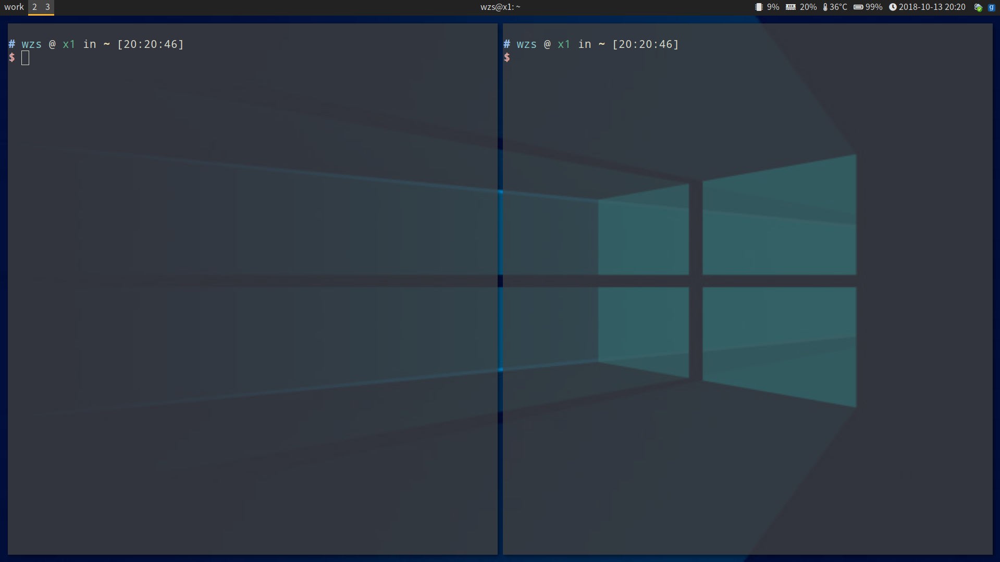

= arch

arch linux 是我个人比较喜欢的系统, 简洁, 自由.

arch 桌面示例:

. link:https://wiki.archlinux.org/index.php/Main_page_(简体中文)[Arch Linux 手册]
. link:https://wiki.archlinux.org/index.php/Arch_Linux_(简体中文[Arch Linux的原则]

== 介绍
各部分介绍如下
* install: 安装相关
    ** install/script 软件的安装脚本
    ** install/script/gui 当作为主力电脑, 日常使用时, 软件的安装脚本.
    ** install/script/server 当作为服务器时, 软件的安装脚本.
    ** install/docker 各种软件的docker版本, 如 hive,spark等, 根据需要安装.
* faq.md: 安装/使用上可能需要的问题解答.

// linux版本比较, win/osx 比较